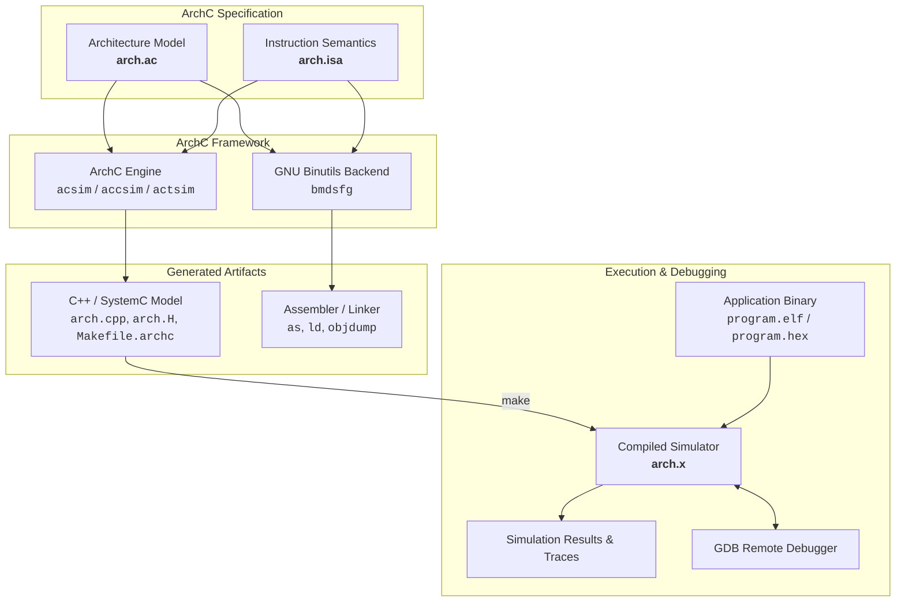

# ArchC: Architecture Description Language

<p align="center">
  <b>A powerful open-source Architecture Description Language (ADL) based on SystemC</b><br>
  Automatically generates high-performance functional (500+ MIPS), compiled, and cycle-accurate processor simulators, binutils backends, and GDB debugger support from a single high-level specification.
</p>

<p align="center">
  <a href="https://github.com/ArchC/ArchC/blob/master/COPYING"></a>
  <a href="https://systemc.org/"></a>
  <a href="https://en.cppreference.com/w/cpp/17"></a>
  
  
  
</p>

---

## 📌 Overview

**ArchC** is an Architecture Description Language (ADL) designed to speed up the exploration, design, and validation of new processor architectures (including **RISC-V**, **ARM**, **MIPS**, **SPARC**, **PowerPC**, **x86**, **8051**, or custom ASIP/DSP cores).

Instead of manually writing instruction set simulators, assemblers, linkers, and debuggers from scratch, developers describe the processor hardware resources and instruction set in two concise files:
1. **Architecture Description (`<arch>.ac`)**: Defines registers, memory hierarchy, caches, pipelines, pipeline stages, and TLM/TLM2 bus interfaces.
2. **Instruction Set Architecture (`<arch>.isa`)**: Defines instruction formats, binary encoding, decode logic, and C/C++ operational semantics for each instruction.

ArchC then automatically compiles this specification into optimized **SystemC models**, **software development tools**, and **debug stubs**.

---

## 🏛️ Supported Architecture Models (`tests/`)

ArchC includes complete, tested, and optimized processor models with native test suites:

| Architecture | Wordsize / Endianness | Features | Folder | Throughput |
|---|---|---|---|:---:|
| **RISC-V** | 32-bit (RV32I / RV64I), LE | R/I/S/B/U/J formats, hardwired `x0`, ELF32 & ELF64 support | [`tests/riscv/`](tests/riscv/) | **~500 MIPS** |
| **ARM** | 32-bit (ARMv7 / AArch32), LE | CPSR flags (N, Z, C, V), 16 condition codes, DP, Mem, Branch | [`tests/arm/`](tests/arm/) | **~500 MIPS** |
| **MIPS** | 32-bit (MIPS-I / MIPS32), BE | 32 GPRs, `hi`/`lo` registers, mult/div, branch delay handling | [`tests/mips/`](tests/mips/) | **571+ MIPS** |
| **SPARC** | 32-bit (SPARC V8), BE | 32 registers (`%g`, `%o`, `%l`, `%i`), `%psr` condition codes | [`tests/sparc/`](tests/sparc/) | **583+ MIPS** |
| **PowerPC** | 32-bit (PPC32), BE | 32 GPRs, Condition Register (`CR`), Link & Count registers | [`tests/powerpc/`](tests/powerpc/) | **500+ MIPS** |
| **Intel x86** | 32-bit (i386 CISC), LE | `EAX`–`EDI`, `EFLAGS` register, displacement addressing | [`tests/i386/`](tests/i386/) | **583+ MIPS** |
| **Intel 8051** | 8-bit Harvard Architecture | Separate `PM`/`DM`, `ACC`, `PSW`, `DPTR`, variable-length ISA | [`tests/m8051/`](tests/m8051/) | **~300k inst/loop** |
| **Bench32** | 32-bit RISC Baseline, LE | Optimized baseline reference suite for profiling and bottlenecks | [`tests/bench32/`](tests/bench32/) | **513+ MIPS** |

Run all architecture tests with a single command:
```bash
python3 tests/run_all_arch_tests.py
```

---

## 🚀 Key Features & Innovations

- **High-Performance Direct Threading Engine**:
  - Direct threading simulation with GCC computed gotos and decode caching (`DEC_CACHE`).
  - **Single-word fast-path** in `GetBits()`: Bypasses multi-word loop allocations for standard instructions.
  - **$O(1)$ Direct Table Indexing in Decoder**: Eliminated linear linked-list traversal during runtime decoding.
- **Native 64-bit ELF (ELF64) Loader**:
  - Full support for `ELFCLASS64` and `ELFCLASS32` binaries with automatic Big/Little-Endian conversion.
- **Multiple Simulator Generators**:
  - **`acsim` (Interpreted Simulator)**: Rapid turnaround instruction set simulator (ISS) with full trace logs and debugging support.
  - **`accsim` (Compiled Simulator)**: High-speed static binary translation to C++ for ultra-fast architectural simulation.
  - **`actsim` (Cycle-Accurate / Timed Simulator)**: Captures pipeline stages, resource hazards, stalls, and multi-cycle execution delays.
- **GNU Binutils Generation (`src/acbinutils`)**: Generates target-specific assembler (`as`), disassembler (`objdump`), and linker (`ld`) backends.
- **GDB Remote Debugging**: Built-in GDB remote serial protocol server allowing native GDB sessions to step, breakpoint, and inspect simulated cores.
- **Power Estimation (`PowerSC`)**: Energy and power consumption estimation module using macro-models during SystemC simulation.
- **SystemC & TLM 2.0 Integration**: Native Transaction-Level Modeling (TLM 1.0 and TLM 2.0) for building virtual platforms and SoC models.

---

## 🔄 Simulation Workflow



---

## 📦 Project Structure

| Component | Path | Description |
|---|---|---|
| **`acsim`** | [`src/acsim/`](src/acsim/) | Interpreted simulator generator |
| **`accsim`** | [`src/accsim/`](src/accsim/) | Compiled simulator generator |
| **`actsim`** | [`src/actsim/`](src/actsim/) | Cycle-accurate / timed simulator generator |
| **`acbinutils`** | [`src/acbinutils/`](src/acbinutils/) | Binutils code generator & relocation converter |
| **`aclib`** | [`src/aclib/`](src/aclib/) | Core runtime library (registers, memory, caches, TLM ports, syscalls) |
| **`acpp`** | [`src/acpp/`](src/acpp/) | ArchC language preprocessor, parser (Flex/Bison), and AST builder |
| **`powersc`** | [`src/powersc/`](src/powersc/) | Power and energy estimation library |
| **`tests`** | [`tests/`](tests/) | Ready-to-use processor models (RISC-V, ARM, MIPS, SPARC, PPC, x86, 8051) |
| **`bin`** | [`bin/`](bin/) | User helper scripts (`ac_run`, `ac_model`, `ac_stat`, `set_env`) |
| **`doc`** | [`doc/`](doc/) | Developer guides, TLM how-to, and migration documents |

---

## 🛠️ Requirements & Installation

### Prerequisites

- **GNU Autotools**: `autoconf` (>= 2.59), `automake` (>= 1.14), `libtool` / `glibtoolize`, `pkg-config`, `m4`, `make`
- **Parsers**: `flex` and `bison`
- **Compiler**: C/C++ compiler supporting C++17 (`clang++` or `g++`)
- **SystemC**: SystemC >= 2.3.0 (including 3.0.x) with TLM 2.0 support
- **Optional**: `elfutils` (`libelf`, `libdw`) for High Level Trace (HLT)

#### macOS (Homebrew)
```bash
brew install systemc pkg-config autoconf automake libtool flex bison
```

#### Linux (Ubuntu / Debian / Fedora)
```bash
# Ubuntu / Debian
sudo apt-get update
sudo apt-get install build-essential autoconf automake libtool pkg-config flex bison libsystemc-dev

# Fedora / RHEL
sudo dnf install autoconf automake libtool pkgconfig flex bison systemc-devel
```

---

## ⚙️ Configuration & Building

### 1. Generate Build Scripts
```bash
./autogen.sh
```

### 2. Configure
```bash
./configure --prefix=$(pwd)/install_local
```

**Common Configuration Flags:**
| Flag | Description |
|---|---|
| `--prefix=<dir>` | Installation directory |
| `--with-systemc=<dir>` | Path to custom SystemC installation |
| `--with-binutils=<dir>` | Path to GNU Binutils source directory |
| `--with-gdb=<dir>` | Path to GNU GDB source directory |
| `--disable-hlt` | Disable High Level Trace feature (if `libelf` is not installed) |

### 3. Compile & Install
```bash
# macOS
make -j$(sysctl -n hw.ncpu) && make install

# Linux
make -j$(nproc) && make install
```

---

## 💻 Quickstart: Creating & Running a Model

### 1. Define Architecture (`riscv.ac`)
```c
AC_ARCH(riscv) {
  ac_mem            DM:512M;           // 512MB address space
  ac_regbank        RB:32;             // 32 integer registers
  ac_wordsize       32;
  ac_fetchsize      32;

  ARCH_CTOR(riscv) {
    ac_isa("riscv.isa");               // Link ISA specification
    set_endian("little");
  };
};
```

### 2. Define Instructions (`riscv.isa`)
```c
AC_ISA(riscv) {
  ac_format Type_R = "%funct7:7 %rs2:5 %rs1:5 %funct3:3 %rd:5 %opcode:7";
  ac_instr<Type_R> add, sub;

  ISA_CTOR(riscv) {
    add.set_asm("add %rd, %rs1, %rs2");
    add.set_decoder(opcode = 0x33, funct3 = 0x0, funct7 = 0x00);
  };
};
```

### 3. Implement Behavior (`riscv_isa.cpp`)
```cpp
void ac_behavior( add ) {
  RB[rd] = RB[rs1] + RB[rs2];
  RB[0] = 0; // x0 hardwired to 0
}
```

### 4. Build and Run Simulator
```bash
acsim riscv.ac -nw -nci
make -f Makefile.archc -j$(sysctl -n hw.ncpu)
./riscv.x --load=program.elf
```

---

## ⚡ Benchmarking & Performance Profiling

Run the complete multi-architecture verification testbench:

```bash
python3 tests/run_all_arch_tests.py
```

### Performance Summary (on Apple Silicon ARM64, SystemC 3.0.2):
- **ALU Throughput**: **500–583 MIPS** across all models.
- **Memory Operations (LW/SW)**: **340–400 MIPS**.
- **Branch / Control Flow**: **360–370 MIPS**.
- **Decode Cache Advantage**: **18× speedup** over on-the-fly decoding (`-ndc`).
- Detailed architectural analysis available in [`tests/bench32/README.md`](tests/bench32/README.md).

---

## 📜 License & Academic Credits

- **ArchC Tools** are licensed under the **GNU General Public License (GPL) v2**. See [`COPYING`](COPYING).
- **ArchC Utility Library (`src/aclib`)** is licensed under the **GNU Lesser General Public License (LGPL) v2**. See [`COPYING.LIB`](COPYING.LIB).

**Developed by:**  
Computer Systems Laboratory (LSC)  
Institute of Computing (IC)  
University of Campinas (UNICAMP), Brazil  
http://www.lsc.ic.unicamp.br
