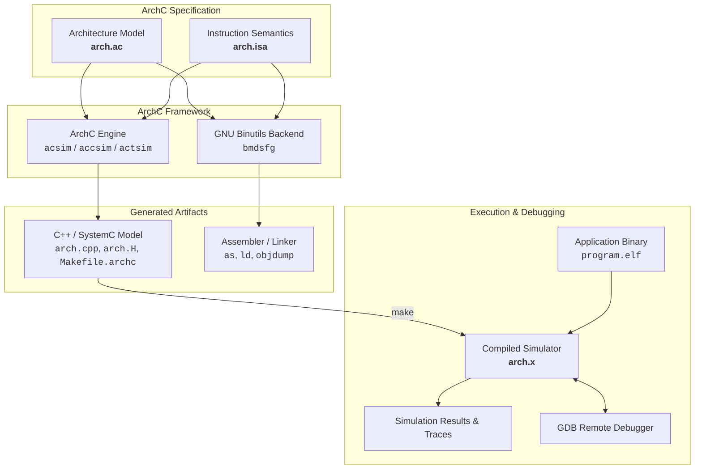

# ArchC: Architecture Description Language

<p align="center">
  <b>A powerful open-source Architecture Description Language (ADL) based on SystemC</b><br>
  Automatically generates functional, compiled, and cycle-accurate processor simulators, binutils backends, and GDB debugger support from a single high-level specification.
</p>

<p align="center">
  <a href="https://github.com/ArchC/ArchC/blob/master/COPYING"></a>
  <a href="https://systemc.org/"></a>
  <a href="https://en.cppreference.com/w/cpp/17"></a>
  
  
</p>

---

## 📌 Overview

**ArchC** is an Architecture Description Language (ADL) designed to speed up the exploration, design, and validation of new processor architectures (such as RISC-V, MIPS, ARM, SPARC, or custom ASIP/DSP cores).

Instead of manually writing instruction set simulators, assemblers, linkers, and debuggers from scratch, developers describe the processor hardware resources and instruction set in two concise files:
1. **Architecture Description (`<arch>.ac`)**: Defines registers, memory hierarchy, caches, pipelines, pipeline stages, and TLM/TLM2 bus interfaces.
2. **Instruction Set Architecture (`<arch>.isa`)**: Defines instruction formats, binary encoding, decode logic, and C/C++ operational semantics for each instruction.

ArchC then automatically compiles this specification into optimized **SystemC models**, **software development tools**, and **debug stubs**.

---

## 🚀 Key Features

- **Multiple Simulator Generators**:
  - **`acsim` (Interpreted Simulator)**: Rapid turnaround instruction set simulator (ISS) with full trace logs and debugging support.
  - **`accsim` (Compiled Simulator)**: High-speed static binary translation to C++ for ultra-fast architectural simulation.
  - **`actsim` (Cycle-Accurate / Timed Simulator)**: Captures pipeline stages, resource hazards, stalls, and multi-cycle execution delays.
- **GNU Binutils Generation (`src/acbinutils`)**: Generates target-specific assembler (`as`), disassembler (`objdump`), and linker (`ld`) patches for GNU Binutils.
- **GDB Remote Debugging**: Built-in GDB remote serial protocol server allowing native GDB sessions to step, breakpoint, and inspect registers/memory inside simulated cores.
- **Power Estimation (`PowerSC`)**: Built-in energy and power consumption estimation module using macro-models during SystemC simulation.
- **System Call Emulation (ABI)**: Emulates POSIX/Linux system calls to execute compiled benchmark programs (e.g. SPEC, CoreMark) without requiring a full OS kernel.
- **SystemC & TLM 2.0 Integration**: Native Transaction-Level Modeling (TLM 1.0 and TLM 2.0) interfaces for building complex MPSoC / NoC virtual platforms.

---

## 🔄 Simulation Workflow



---

## 📦 Project Structure

| Component | Path | Description |
|---|---|---|
| **`acsim`** | [`src/acsim/`](src/acsim/) | Interpreted simulator generator |
| **`accsim`** | [`src/accsim/`](src/accsim/) | Compiled simulator generator |
| **`actsim`** | [`src/actsim/`](src/actsim/) | Cycle-accurate / timed simulator generator |
| **`acbinutils`** | [`src/acbinutils/`](src/acbinutils/) | Binutils code generator & relocation converter |
| **`aclib`** | [`src/aclib/`](src/aclib/) | Core runtime library (registers, memory, caches, TLM ports, syscalls) |
| **`acpp`** | [`src/acpp/`](src/acpp/) | ArchC language preprocessor, parser (Flex/Bison), and AST builder |
| **`powersc`** | [`src/powersc/`](src/powersc/) | Power and energy estimation library |
| **`bin`** | [`bin/`](bin/) | User helper scripts (`ac_run`, `ac_model`, `ac_stat`, `set_env`) |
| **`doc`** | [`doc/`](doc/) | Developer guides, TLM how-to, and migration documents |

---

## 🛠️ Requirements & Installation

### Prerequisites

- **GNU Autotools**: `autoconf` (>= 2.59), `automake` (>= 1.14), `libtool` / `glibtoolize`, `pkg-config`, `m4`, `make`
- **Parsers**: `flex` and `bison`
- **Compiler**: C/C++ compiler supporting C++17 (`clang++` or `g++`)
- **SystemC**: SystemC >= 2.3.0 (including 3.0.x) with TLM 2.0 support
- **Optional**: `elfutils` (`libelf`, `libdw`) for High Level Trace (HLT)

#### macOS (Homebrew)
```bash
brew install systemc pkg-config autoconf automake libtool flex bison
```

#### Linux (Ubuntu / Debian)
```bash
sudo apt-get update
sudo apt-get install build-essential autoconf automake libtool pkg-config flex bison libsystemc-dev
```

---

## ⚙️ Configuration & Building

### 1. Generate Build Scripts
```bash
./autogen.sh
```

### 2. Configure
```bash
./configure
```

**Common Configuration Flags:**
| Flag | Description |
|---|---|
| `--prefix=<dir>` | Installation directory (default: `/usr/local`) |
| `--with-systemc=<dir>` | Path to custom SystemC installation |
| `--with-binutils=<dir>` | Path to GNU Binutils source directory |
| `--with-gdb=<dir>` | Path to GNU GDB source directory |
| `--disable-hlt` | Disable High Level Trace feature (if `libelf` is not installed) |

### 3. Compile
```bash
# macOS
make -j$(sysctl -n hw.ncpu)

# Linux
make -j$(nproc)
```

### 4. Verify & Test
```bash
# Run build self-tests
make check

# Test generator binaries
src/acsim/acsim --help
src/accsim/accsim --help
src/actsim/actsim --help
```

### 5. Install & Set Environment
```bash
# Optional system installation
make install

# Source environment variables in current shell
source env.sh
```

---

## 💻 Quickstart: Creating & Running a Model

### 1. Define Architecture (`mips.ac`)
```c
AC_ARCH(mips) {
  ac_mem            DM:512M;           // Data memory
  ac_regbank        RB:32;             // 32 general-purpose registers
  ac_reg<unsigned>  NPC;               // Next Program Counter

  ARCH_CTOR(mips) {
    ac_isa("mips.isa");                // Link ISA specification
    set_endian("big");
  };
};
```

### 2. Define Instructions (`mips.isa`)
```c
AC_ISA(mips) {
  ac_format Type_R = "%op:6 %rs:5 %rt:5 %rd:5 %shamt:5 %func:6";
  ac_instr<Type_R> add, sub, and, or;

  add.set_asm("add %rd, %rs, %rt");
  add.behavior({
    RB[rd] = RB[rs] + RB[rt];
  });
};
```

### 3. Generate and Run the Simulator
```bash
# Using the automated helper
./bin/ac_run mips hello.elf

# Or manually:
acsim mips.ac
make -f Makefile.archc
./mips.x --load=hello.elf
```

---

## ⚡ Benchmarking & Performance Profiling

An automated benchmark and profiling testbench is available in [`tests/bench32/`](tests/bench32/):

```bash
cd tests/bench32
python3 run_profiler.py
```

### Performance Summary (on Apple Silicon ARM64, SystemC 3.0.2):
- **ALU Throughput (Optimized)**: **~507.9 MIPS** (vs 154.3 MIPS baseline, **3.3× speedup**)
- **Mixed Kernel (Compute/Mem)**: **~450.2 MIPS** (vs 136.6 MIPS baseline)
- **Branch / Control Flow**: **~361.4 MIPS** (vs 142.4 MIPS baseline)
- **Memory Operations (LW/SW)**: **~341.7 MIPS** (vs 119.7 MIPS baseline)
- **Decode Cache Advantage**: **18× speedup** over on-the-fly decoding (`-ndc`).
- Detailed architectural analysis and bottleneck breakdown available in [`tests/bench32/README.md`](tests/bench32/README.md).

---

## 📖 Documentation & Resources

- [ArchC Official Website](http://www.archc.org)
- [Performance & Benchmarking Guide](tests/bench32/README.md)
- [TLM How-to Guide](doc/tlm_howto.txt)
- [Porting Guide](doc/porting_to_2.txt)
- [What's New in ArchC 2.x](doc/whats_new.txt)
- [Contributing Guidelines](CONTRIBUTING.md)

---

## 📜 License & Academic Credits

- **ArchC Tools** are licensed under the **GNU General Public License (GPL) v2**. See [`COPYING`](COPYING).
- **ArchC Utility Library (`src/aclib`)** is licensed under the **GNU Lesser General Public License (LGPL) v2**. See [`COPYING.LIB`](COPYING.LIB).

**Developed by:**  
Computer Systems Laboratory (LSC)  
Institute of Computing (IC)  
University of Campinas (UNICAMP), Brazil  
http://www.lsc.ic.unicamp.br
